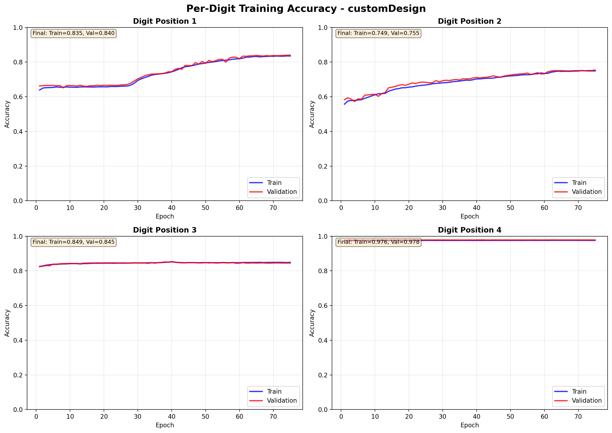
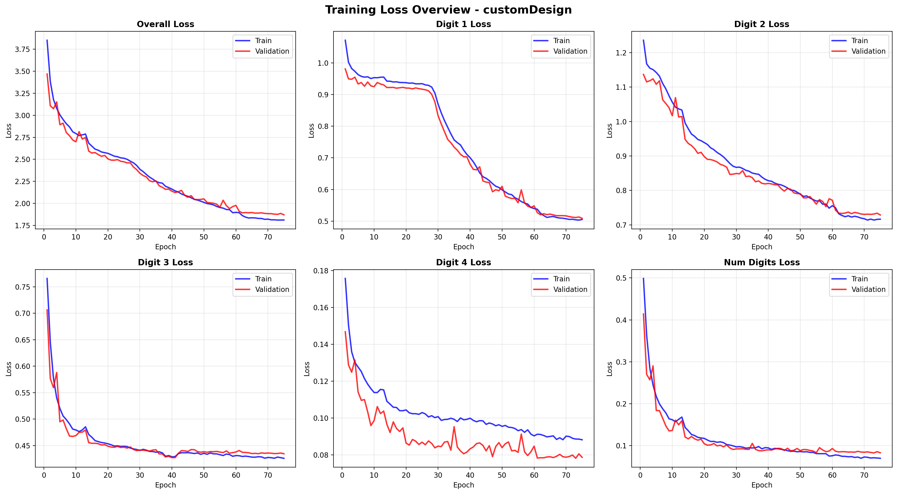
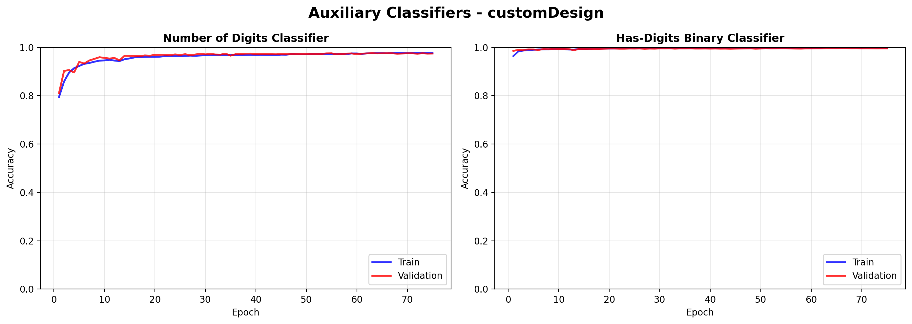
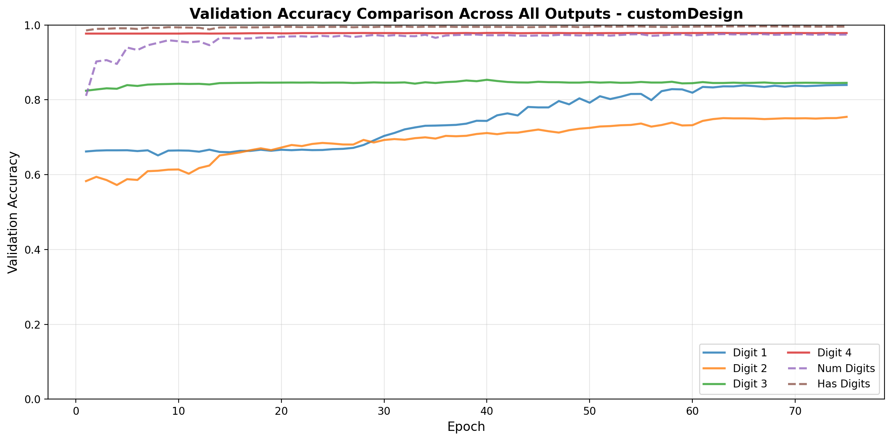

# Training Report: customDesign

**Generated:** 2025-12-26 20:29:47

---

## Executive Summary

- **Total Epochs:** 75
- **Best Validation Loss:** 1.8710 (Epoch 75)
- **Final Training Loss:** 1.8120
- **Final Validation Loss:** 1.8710
- **Test Sequence Accuracy:** 35.33%
- **Validation Sequence Accuracy:** 66.37%
- **Training Sequence Accuracy:** 68.40%

## Training Status

✅ **Converged:** Model has converged (low loss variance in final epochs)

✅ **No Significant Overfitting**

## Detailed Performance Metrics

### Sequence-Level Accuracy

| Dataset | Sequence Accuracy |
|---------|-------------------|
| Training | 68.40% |
| Validation | 66.37% |
| Test | 35.33% |

### Per-Component Accuracy (Test Set)

| Component | Accuracy |
|-----------|----------|
| Number of Digits | 95.04% |
| Digit Position 1 | 67.28% |
| Digit Position 2 | 52.44% |
| Digit Position 3 | 81.49% |
| Digit Position 4 | 98.78% |
| Has Digits (Binary) | 99.34% |

## Per-Digit Position Analysis

### Performance Ranking (by validation accuracy)

📊 **Digit Position 2**
   - Validation Accuracy: 75.45%
   - Training Accuracy: 74.88%
   - Train-Val Gap: -0.57%

🥉 **Digit Position 1**
   - Validation Accuracy: 83.97%
   - Training Accuracy: 83.51%
   - Train-Val Gap: -0.46%

🥈 **Digit Position 3**
   - Validation Accuracy: 84.53%
   - Training Accuracy: 84.90%
   - Train-Val Gap: 0.37%

🥇 **Digit Position 4**
   - Validation Accuracy: 97.84%
   - Training Accuracy: 97.60%
   - Train-Val Gap: -0.24%

### Areas of Difficulty

⚠️ **Digit Position 2** shows the lowest accuracy (75.45%)
   - This position may need additional attention or data augmentation

## Training Progression

- **Initial Validation Loss:** 3.4686
- **Best Validation Loss:** 1.8710
- **Total Improvement:** 46.1%

## Visualizations

### Per-Digit Accuracy



### Loss Overview



### Auxiliary Classifiers



### Validation Accuracy Comparison



## Recommendations

3. **Improve Digit Position 2:**
   - Analyze misclassified examples
   - Consider position-specific data augmentation
   - Review label quality for this position

4. **Test-Validation Gap:**
   - Test accuracy significantly lower than validation
   - Possible data distribution mismatch
   - Review test set characteristics

## Training History Summary

```
Total epochs: 75
Best epoch: 75
Loss improvement: 46.1%
Converged: True
Overfitting detected: False
```
