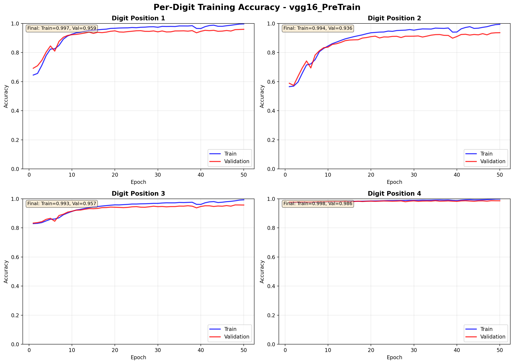
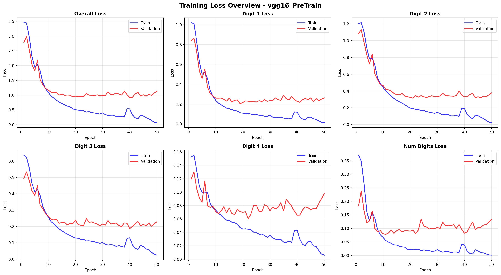
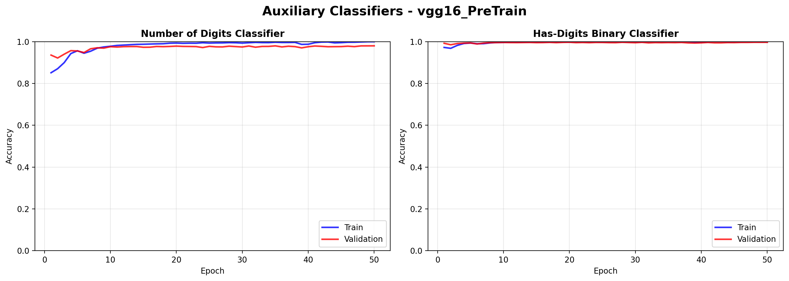
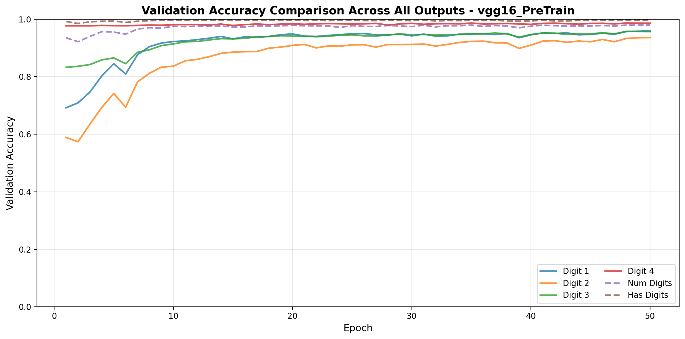

# Training Report: vgg16_PreTrain

**Generated:** 2025-12-26 20:24:02

---

## Executive Summary

- **Total Epochs:** 50
- **Best Validation Loss:** 0.9191 (Epoch 40)
- **Final Training Loss:** 0.0657
- **Final Validation Loss:** 1.1333
- **Test Sequence Accuracy:** 78.20%
- **Validation Sequence Accuracy:** 88.57%
- **Training Sequence Accuracy:** 98.71%

## Training Status

⚠️ **Not Fully Converged:** Model may benefit from additional training

⚠️ **Overfitting Detected:** Validation loss significantly higher than training loss
   - Consider adding regularization, dropout, or early stopping

## Detailed Performance Metrics

### Sequence-Level Accuracy

| Dataset | Sequence Accuracy |
|---------|-------------------|
| Training | 98.71% |
| Validation | 88.57% |
| Test | 78.20% |

### Per-Component Accuracy (Test Set)

| Component | Accuracy |
|-----------|----------|
| Number of Digits | 96.63% |
| Digit Position 1 | 90.83% |
| Digit Position 2 | 86.71% |
| Digit Position 3 | 94.13% |
| Digit Position 4 | 99.03% |
| Has Digits (Binary) | 99.47% |

## Per-Digit Position Analysis

### Performance Ranking (by validation accuracy)

📊 **Digit Position 2**
   - Validation Accuracy: 93.61%
   - Training Accuracy: 99.38%
   - Train-Val Gap: 5.76%

🥉 **Digit Position 3**
   - Validation Accuracy: 95.69%
   - Training Accuracy: 99.26%
   - Train-Val Gap: 3.57%

🥈 **Digit Position 1**
   - Validation Accuracy: 95.95%
   - Training Accuracy: 99.66%
   - Train-Val Gap: 3.71%

🥇 **Digit Position 4**
   - Validation Accuracy: 98.61%
   - Training Accuracy: 99.83%
   - Train-Val Gap: 1.22%

### Areas of Difficulty

✅ All digit positions performing well (>85% accuracy)

## Training Progression

- **Initial Validation Loss:** 2.7852
- **Best Validation Loss:** 0.9191
- **Total Improvement:** 67.0%

## Visualizations

### Per-Digit Accuracy



### Loss Overview



### Auxiliary Classifiers



### Validation Accuracy Comparison



## Recommendations

1. **Address Overfitting:**
   - Increase dropout rates
   - Add L2 regularization
   - Use data augmentation
   - Reduce model complexity

2. **Improve Convergence:**
   - Train for more epochs
   - Adjust learning rate schedule
   - Use different optimizer settings

4. **Test-Validation Gap:**
   - Test accuracy significantly lower than validation
   - Possible data distribution mismatch
   - Review test set characteristics

## Training History Summary

```
Total epochs: 50
Best epoch: 40
Loss improvement: 67.0%
Converged: False
Overfitting detected: True
```
